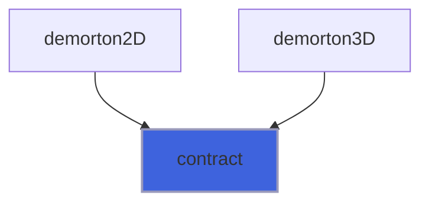
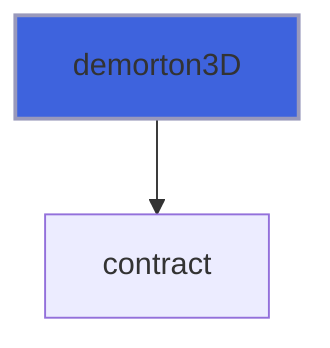
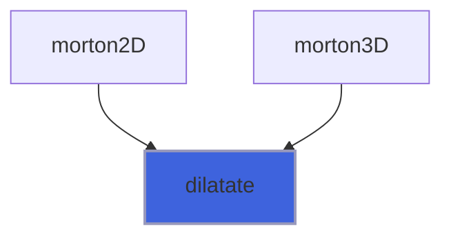
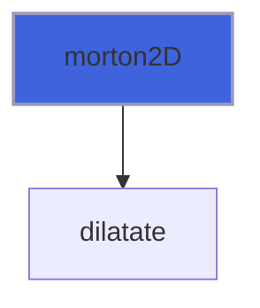
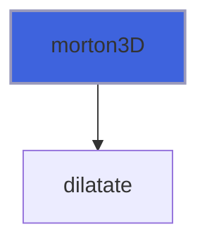

# mortif

> MORTIF, MORTon Indexer (Z-order) Fortran environment.

 A library to encode/decode integer indexes into Morton's (Z-order) ordering.
 Morton's code (Z-order) is a scheme to map multi-dimensional arrays onto to a linear with a great deal of spatial locality.

#### References

 [1] *A Computer Oriented Geodetic Data Base and a New Technique in File Sequencing*, Morton G.M., technical report, IBM, 1966.
 [2] *On Spatial Orders and Location Codes*, Stocco, LJ and Schrack, G, IEEE Transaction on Computers, vol 58, n 3, March 2009.
 [3] *Out-of-Core Construction of Sparse Voxel Octrees*, J. Baert, A. Lagae and Ph. Dutré, Proceedings of the Fifth ACM
 SIGGRAPH/Eurographics conference on High-Performance Graphics, 2013.

**Source**: `src/lib/mortif.f90`

**Dependencies**


## Contents

- [contract](#contract)
- [demorton2D](#demorton2d)
- [demorton3D](#demorton3d)
- [dilatate](#dilatate)
- [morton2D](#morton2d)
- [morton3D](#morton3d)

## Variables

| Name | Type | Attributes | Description |
|------|------|------------|-------------|
| `mask32_32` | integer(kind=[I8P](/api/src/third_party/PENF/src/lib/penf_global_parameters_variables)) | parameter | 0000000000000000000000000000000011111111111111111111111111111111. |
| `mask16_48` | integer(kind=[I8P](/api/src/third_party/PENF/src/lib/penf_global_parameters_variables)) | parameter | 0000000000000000000000000000000000000000000000001111111111111111. |
| `mask16_32` | integer(kind=[I8P](/api/src/third_party/PENF/src/lib/penf_global_parameters_variables)) | parameter | 1111111111111111000000000000000000000000000000001111111111111111. |
| `mask16_16` | integer(kind=[I8P](/api/src/third_party/PENF/src/lib/penf_global_parameters_variables)) | parameter | 0000000000000000111111111111111100000000000000001111111111111111. |
| `mask8_56` | integer(kind=[I8P](/api/src/third_party/PENF/src/lib/penf_global_parameters_variables)) | parameter | 0000000000000000000000000000000000000000000000000000000011111111. |
| `mask8_16` | integer(kind=[I8P](/api/src/third_party/PENF/src/lib/penf_global_parameters_variables)) | parameter | 0000000011111111000000000000000011111111000000000000000011111111. |
| `mask8_8` | integer(kind=[I8P](/api/src/third_party/PENF/src/lib/penf_global_parameters_variables)) | parameter | 0000000011111111000000001111111100000000111111110000000011111111. |
| `mask4_60` | integer(kind=[I8P](/api/src/third_party/PENF/src/lib/penf_global_parameters_variables)) | parameter | 0000000000000000000000000000000000000000000000000000000000001111. |
| `mask4_8` | integer(kind=[I8P](/api/src/third_party/PENF/src/lib/penf_global_parameters_variables)) | parameter | 1111000000001111000000001111000000001111000000001111000000001111. |
| `mask4_4` | integer(kind=[I8P](/api/src/third_party/PENF/src/lib/penf_global_parameters_variables)) | parameter | 0000111100001111000011110000111100001111000011110000111100001111. |
| `mask2_62` | integer(kind=[I8P](/api/src/third_party/PENF/src/lib/penf_global_parameters_variables)) | parameter | 0000000000000000000000000000000000000000000000000000000000000011. |
| `mask2_4` | integer(kind=[I8P](/api/src/third_party/PENF/src/lib/penf_global_parameters_variables)) | parameter | 0011000011000011000011000011000011000011000011000011000011000011. |
| `mask2_2` | integer(kind=[I8P](/api/src/third_party/PENF/src/lib/penf_global_parameters_variables)) | parameter | 0011001100110011001100110011001100110011001100110011001100110011. |
| `mask1_2` | integer(kind=[I8P](/api/src/third_party/PENF/src/lib/penf_global_parameters_variables)) | parameter | 1001001001001001001001001001001001001001001001001001001001001001. |
| `mask1_1` | integer(kind=[I8P](/api/src/third_party/PENF/src/lib/penf_global_parameters_variables)) | parameter | 0101010101010101010101010101010101010101010101010101010101010101. |
| `signif` | integer(kind=[I8P](/api/src/third_party/PENF/src/lib/penf_global_parameters_variables)) | parameter | Binary mask for selecting significant bits. |
| `mask` | integer(kind=[I8P](/api/src/third_party/PENF/src/lib/penf_global_parameters_variables)) | parameter | Binary mask for perfoming significant bits shifting. |
| `shft` | integer(kind=[I1P](/api/src/third_party/PENF/src/lib/penf_global_parameters_variables)) | parameter | Shift number array. |
| `log10_2_inv` | real(kind=[R4P](/api/src/third_party/PENF/src/lib/penf_global_parameters_variables)) | parameter | Real parameter for computing the number of shifts (Ns). |

## Subroutines

### contract

Contract integer of 64 bits into integer of 32 bits.

 See *On Spatial Orders and Location Codes*, Stocco, LJ and Schrack, G, IEEE Transaction on Computers, vol 58, n 3, March 2009.
 The resulting integer(int8/int16/int32) has only `b' significant bits obtained by the following contraction:
 if `bb/zx0/bb-1/zx0../b1/zx0/b0 => bb/bb-1/.../b1/b0`; e.g. for `(b=4,z=1)`: `b3/0/b2/0/b1/0/b0 => b3/b2/b1/b0`.

**Attributes**: elemental

```fortran
subroutine contract(i, b, z, c)
```

**Arguments**

| Name | Type | Intent | Attributes | Description |
|------|------|--------|------------|-------------|
| `i` | integer(kind=[I8P](/api/src/third_party/PENF/src/lib/penf_global_parameters_variables)) | in |  | Input integer. |
| `b` | integer(kind=[I2P](/api/src/third_party/PENF/src/lib/penf_global_parameters_variables)) | in |  | Number of significant bits of 'i' (2/4/8/16/32). |
| `z` | integer(kind=[I1P](/api/src/third_party/PENF/src/lib/penf_global_parameters_variables)) | in |  | Number of zero 'i' (1/2). |
| `c` | integer(kind=[I4P](/api/src/third_party/PENF/src/lib/penf_global_parameters_variables)) | out |  | Contracted integer. |

**Call graph**



### demorton2D

Decode 1 integer (64 bits) Morton's code into 2 integer (32 bits) indexes.

**Attributes**: elemental

```fortran
subroutine demorton2D(code, i, j, b)
```

**Arguments**

| Name | Type | Intent | Attributes | Description |
|------|------|--------|------------|-------------|
| `code` | integer(kind=[I8P](/api/src/third_party/PENF/src/lib/penf_global_parameters_variables)) | in |  | Morton's code. |
| `i` | integer(kind=[I4P](/api/src/third_party/PENF/src/lib/penf_global_parameters_variables)) | inout |  | I index. |
| `j` | integer(kind=[I4P](/api/src/third_party/PENF/src/lib/penf_global_parameters_variables)) | inout |  | J index. |
| `b` | integer(kind=[I2P](/api/src/third_party/PENF/src/lib/penf_global_parameters_variables)) | in | optional | Number of significant bits of 'i' (2/4/8/16/32). |

**Call graph**


### demorton3D

Decode 1 integer (64 bits) Morton's code into 3 integer (16 bits) indexes.

 @note Due to 64 bits limit of the Morton's code, the 3 allowed-side of indexes is limited to 21 bits.

**Attributes**: elemental

```fortran
subroutine demorton3D(code, i, j, k, b)
```

**Arguments**

| Name | Type | Intent | Attributes | Description |
|------|------|--------|------------|-------------|
| `code` | integer(kind=[I8P](/api/src/third_party/PENF/src/lib/penf_global_parameters_variables)) | in |  | Morton's code. |
| `i` | integer(kind=[I4P](/api/src/third_party/PENF/src/lib/penf_global_parameters_variables)) | inout |  | I index. |
| `j` | integer(kind=[I4P](/api/src/third_party/PENF/src/lib/penf_global_parameters_variables)) | inout |  | J index. |
| `k` | integer(kind=[I4P](/api/src/third_party/PENF/src/lib/penf_global_parameters_variables)) | inout |  | K index. |
| `b` | integer(kind=[I2P](/api/src/third_party/PENF/src/lib/penf_global_parameters_variables)) | in | optional | Number of significant bits of 'i' (2/4/8/16). |

**Call graph**



## Functions

### dilatate

Dilatate integer of 32 bits to integer of 64 bits.

 See *On Spatial Orders and Location Codes*, Stocco, LJ and Schrack, G, IEEE Transaction on Computers, vol 58, n 3, March 2009.
 The resulting integer has 64 bits; it has only `b` significant bits interleaved by `z` zeros: `bb/zx0/bb-1/zx0../b1/zx0/b0`;
 e.g. for `(b=4, z=1)`: `b3/b2/b1/b0 => b3/0/b2/0/b1/0/b0`.

**Attributes**: elemental

**Returns**: integer(kind=[I8P](/api/src/third_party/PENF/src/lib/penf_global_parameters_variables))

```fortran
function dilatate(i, b, z) result(d)
```

**Arguments**

| Name | Type | Intent | Attributes | Description |
|------|------|--------|------------|-------------|
| `i` | integer(kind=[I4P](/api/src/third_party/PENF/src/lib/penf_global_parameters_variables)) | in |  | Input integer. |
| `b` | integer(kind=[I2P](/api/src/third_party/PENF/src/lib/penf_global_parameters_variables)) | in |  | Number of significant bits of 'i' (2/4/8/16/32). |
| `z` | integer(kind=[I1P](/api/src/third_party/PENF/src/lib/penf_global_parameters_variables)) | in |  | Number of zero 'i' (1/2). |

**Call graph**



### morton2D

Encode 2 integer (32 bits) indexes into 1 integer (64 bits) Morton's code.

**Attributes**: elemental

**Returns**: integer(kind=[I8P](/api/src/third_party/PENF/src/lib/penf_global_parameters_variables))

```fortran
function morton2D(i, j, b) result(code)
```

**Arguments**

| Name | Type | Intent | Attributes | Description |
|------|------|--------|------------|-------------|
| `i` | integer(kind=[I4P](/api/src/third_party/PENF/src/lib/penf_global_parameters_variables)) | in |  | I index. |
| `j` | integer(kind=[I4P](/api/src/third_party/PENF/src/lib/penf_global_parameters_variables)) | in |  | J index. |
| `b` | integer(kind=[I2P](/api/src/third_party/PENF/src/lib/penf_global_parameters_variables)) | in | optional | Number of significant bits of 'i' (2/4/8/16/32). |

**Call graph**



### morton3D

Encode 3 integer (32 bits) indexes into 1 integer (64 bits) Morton's code.

 @note Due to 64 bits limit of the Morton's code, the 3 allowed-side of indexes is limited to 21 bits.

**Attributes**: elemental

**Returns**: integer(kind=[I8P](/api/src/third_party/PENF/src/lib/penf_global_parameters_variables))

```fortran
function morton3D(i, j, k, b) result(code)
```

**Arguments**

| Name | Type | Intent | Attributes | Description |
|------|------|--------|------------|-------------|
| `i` | integer(kind=[I4P](/api/src/third_party/PENF/src/lib/penf_global_parameters_variables)) | in |  | I index. |
| `j` | integer(kind=[I4P](/api/src/third_party/PENF/src/lib/penf_global_parameters_variables)) | in |  | J index. |
| `k` | integer(kind=[I4P](/api/src/third_party/PENF/src/lib/penf_global_parameters_variables)) | in |  | K index. |
| `b` | integer(kind=[I2P](/api/src/third_party/PENF/src/lib/penf_global_parameters_variables)) | in | optional | Number of significant bits of 'i' (2/4/8/16/32). |

**Call graph**


