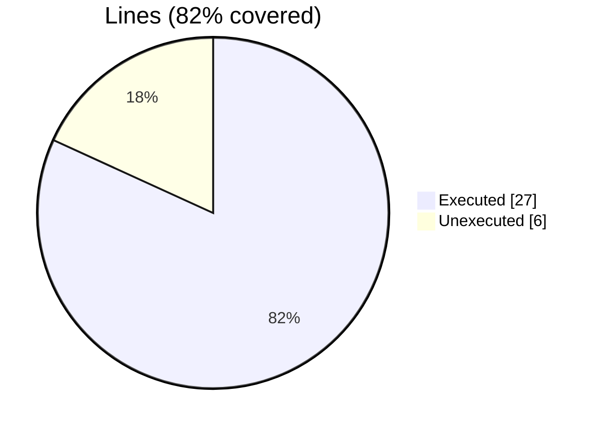
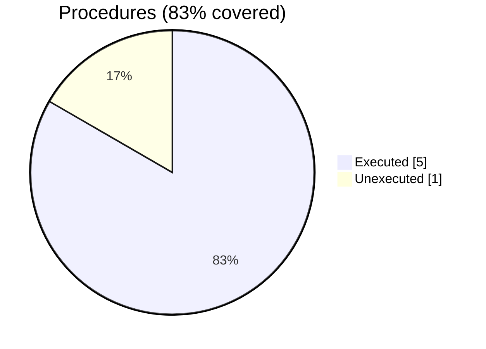
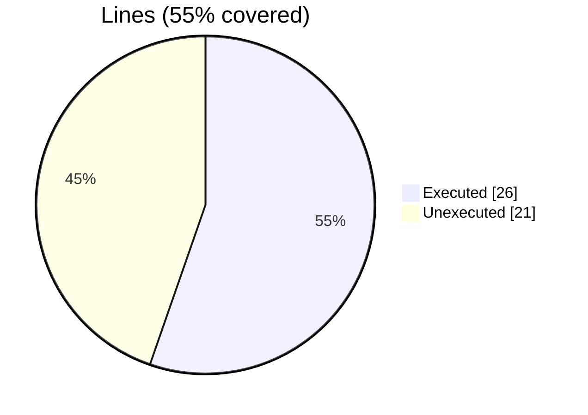
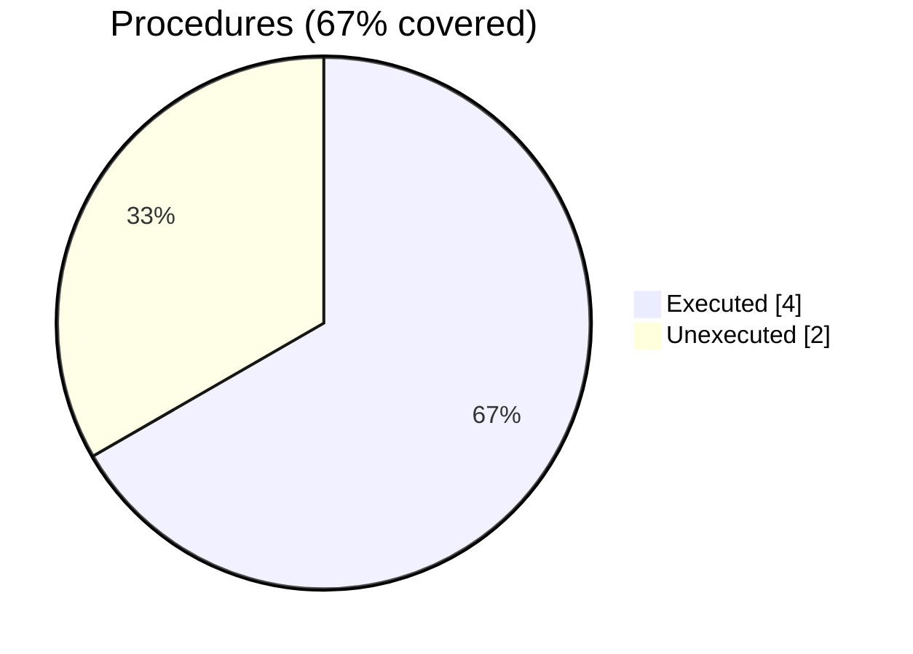

### coverage-analysis

#### [[mortif_test_correctness.f90.gcov]]

|Lines| | |
| --- | --- | --- |
|Executable lines            |33| |
|Executed lines              |27|82%|
|Unexecuted lines            |6|18%|
|Average hits / executed     |1.7407407407407407| |

|Procedures| | |
| --- | --- | --- |
|Total procedures            |6| |
|Executed procedures         |5|83%|
|Unexecuted procedures       |1|17%|
|Average hits / executed     |1.6| |

#### [[mortif.f90.gcov]]

|Lines| | |
| --- | --- | --- |
|Executable lines            |47| |
|Executed lines              |26|55%|
|Unexecuted lines            |21|45%|
|Average hits / executed     |8.76923076923077| |

|Procedures| | |
| --- | --- | --- |
|Total procedures            |6| |
|Executed procedures         |4|67%|
|Unexecuted procedures       |2|33%|
|Average hits / executed     |4.0| |

