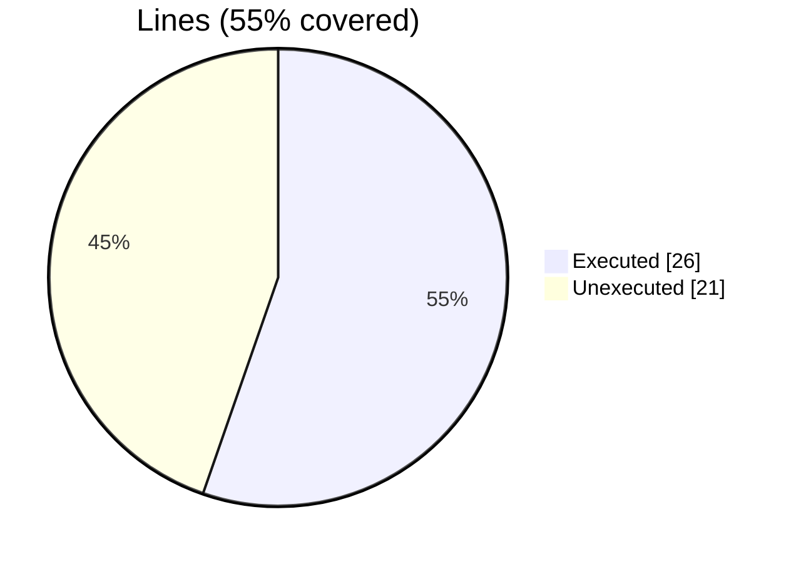
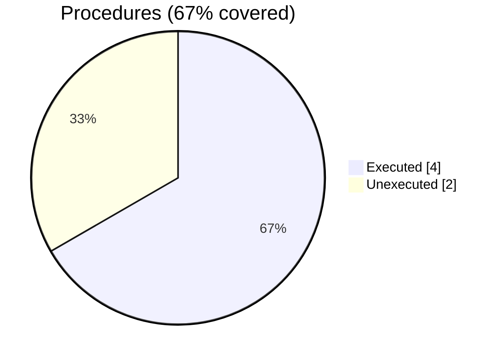

### Coverage analysis of *mortif.f90*

|Lines| | |
| --- | --- | --- |
|Executable lines            |47| |
|Executed lines              |26|55%|
|Unexecuted lines            |21|45%|
|Average hits / executed     |8.76923076923077| |

|Procedures| | |
| --- | --- | --- |
|Total procedures            |6| |
|Executed procedures         |4|67%|
|Unexecuted procedures       |2|33%|
|Average hits / executed     |4.0| |

#### Unexecuted procedures

 + *function* **morton2D**, line 113
 + *subroutine* **demorton2D**, line 132

#### Executed procedures

 + *function* **dilatate**: tested **6** times
 + *subroutine* **contract**: tested **6** times
 + *function* **morton3D**: tested **2** times
 + *subroutine* **demorton3D**: tested **2** times

 --- 
 Report generated by [FoBiS.py](https://github.com/szaghi/FoBiS)