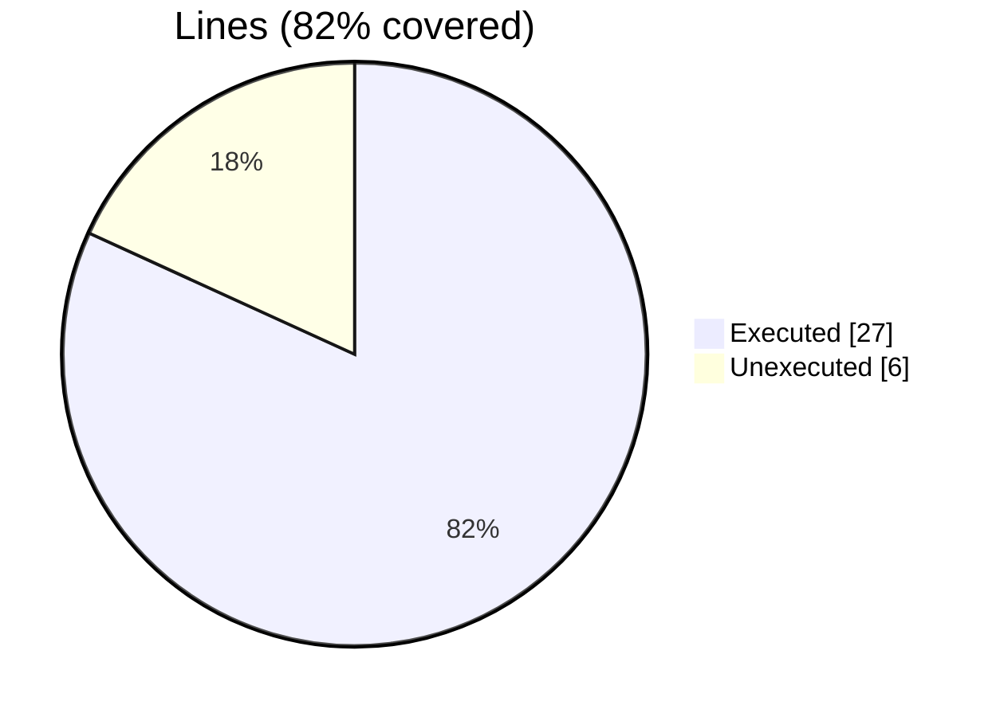
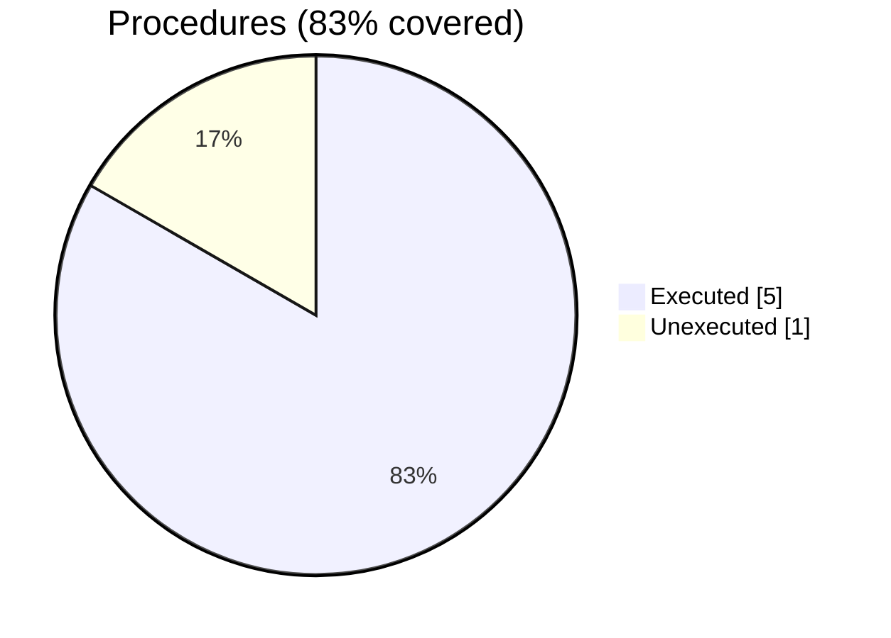

### Coverage analysis of *mortif_test_correctness.f90*

|Lines| | |
| --- | --- | --- |
|Executable lines            |33| |
|Executed lines              |27|82%|
|Unexecuted lines            |6|18%|
|Average hits / executed     |1.7407407407407407| |

|Procedures| | |
| --- | --- | --- |
|Total procedures            |6| |
|Executed procedures         |5|83%|
|Unexecuted procedures       |1|17%|
|Average hits / executed     |1.6| |

#### Unexecuted procedures

 + *subroutine* **assert_equal_i64**, line 35

#### Executed procedures

 + *subroutine* **assert_equal_i32**: tested **2** times
 + *subroutine* **assert_equal_logical**: tested **2** times
 + *subroutine* **test_morton3D**: tested **2** times
 + *subroutine* **init**: tested **1** times
 + *subroutine* **print_results**: tested **1** times

 --- 
 Report generated by [FoBiS.py](https://github.com/szaghi/FoBiS)